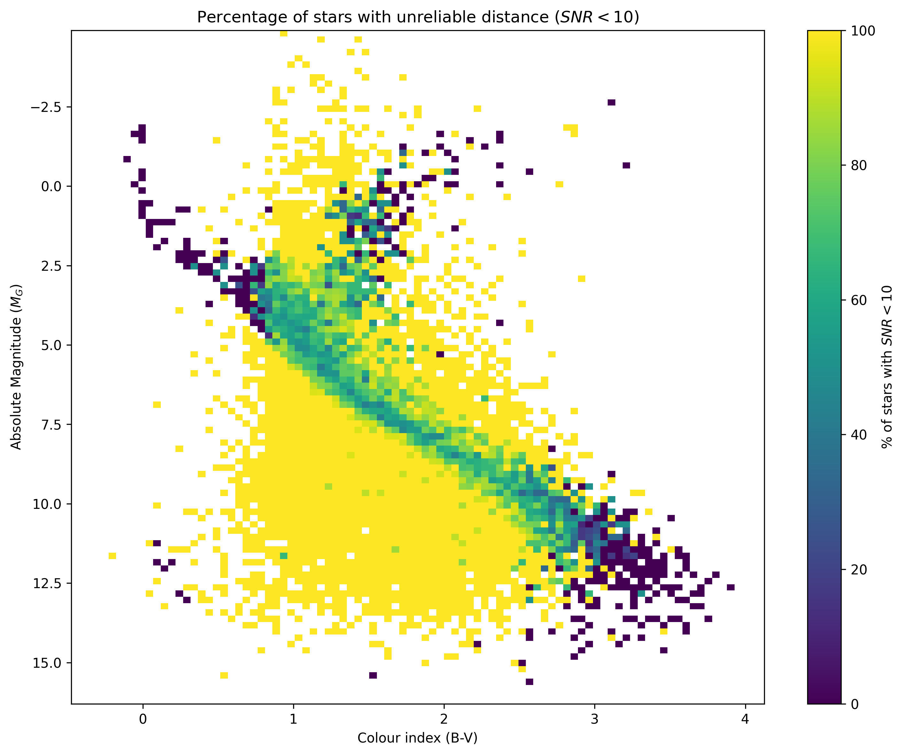

# Gaia HR Diagram Bias

This project explores the construction of the Hertzsprung–Russell (H-R) diagram using **Gaia DR3** data for the **Pleiades** star cluster in order to investigate the effects and limitations of estimating stellar distances from the inverse of the measured parallax.

## Overview

The notebook covers (at moment...):

- Querying Gaia DR3 data with `astroquery`.
- Computing stellar distances and absolute magnitudes.
- Building the Hertzsprung–Russell diagram...


<p >
  
</p>

## Repository structure

```
.
├── Bibliography/
├── Notebooks/
├── requirements.txt
└── README.md
```

## Requirements


## References

- Gaia Data Release 3 (Gaia Collaboration)
- Bailer-Jones, C. A. L. (2015). *Estimating distances from parallaxes.*
- Lutz, T. E. & Kelker, D. H. (1973). *On the Use of Trigonometric Parallaxes for the Calibration of Luminosity Systems.*

